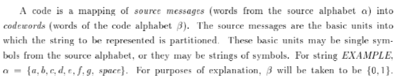
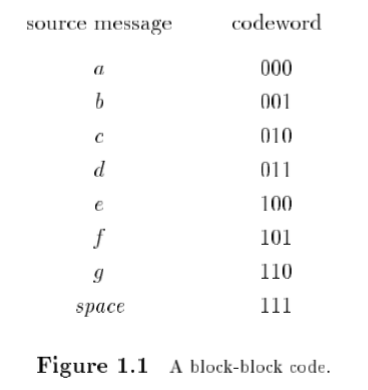
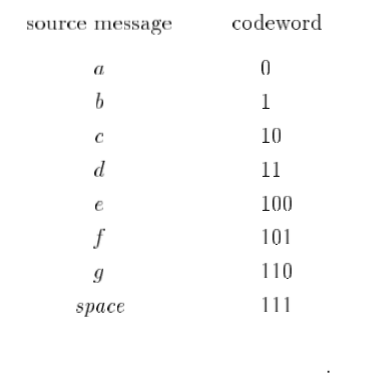
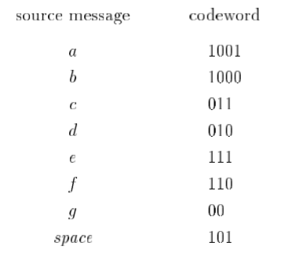
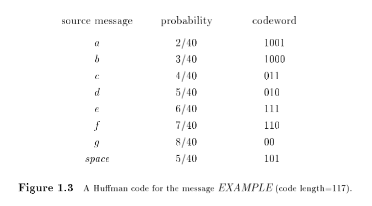
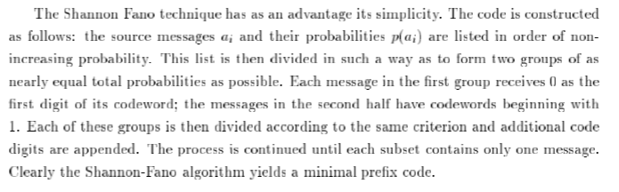
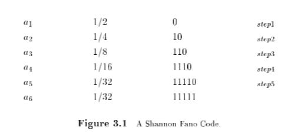
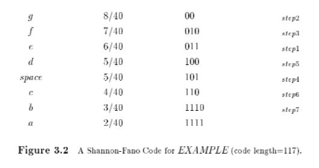
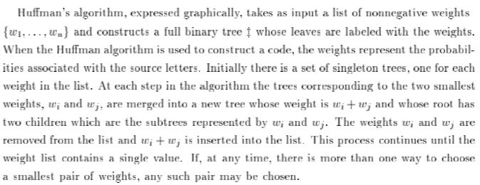
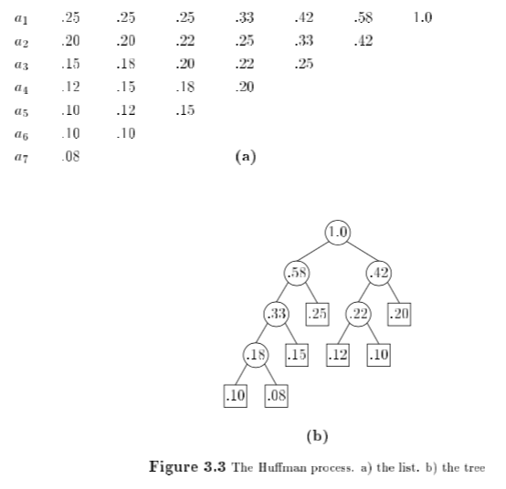

# [fit] Data Compression

# @pfrazee

---

# [fit] 40 years of research. Late 40s to 1986.

---

# [fit] compression:
# [fit] reduce redundancy via encoding

---

# Compression occurs when
# the new encoding takes fewer bits

---

# Run-length encoding

Ten zeros in a row:

```
  [ 0 0 0 0 0 0 0 0 0 0 ]
```

Can be compressed to 2 numbers:

```
  [ 0 10 ]
```

Which mean:

```
  [ value, howMany ]
```

**Tada! Compression!**

---

# Not so fast!

 - Great for images and some DBs, **not great for textual data**
 - RLE depends on contiguous regions of == data ("local redundancy")
 - Not a good *general-purpose* algorithm

---

# [fit] The ABCs
## (alphabets)
# [fit] of compression

---

# [fit] Compression is mapping of
# [fit] **source messages** into **codewords**.



---

# Source alphabet

 - **Predefined**...
   - Letters of the alphabet (.txt)
   - Tokens of a language (.js, .cpp)
   - Etc.
 - or **Free-parse**: created at runtime.

---

# Codeword alphabet

**Another alphabet**, which uses fewer bits.

---

# [fit] But, how can **another alphabet** take fewer bits?

---



---

## [fit] **Block**: alphabet is fixed-length

## [fit] **Variable**: alphabet is variable length

---

## **block-block**
## block-variable
## variable-block
## variable-variable


---

## block-block
## **block-variable**
## variable-block
## variable-variable



---

## block-block
## block-variable
## variable-block
## **variable-variable**


---

# [fit] Variable-length encoding

---

# [fit] *uniquely decodeable*
# [fit] "every codeword is uniquely identifiable
# [fit] when immersed in a sequence of codewords"

---

# **Not** uniquely decodeable

# what is `11011` ?


---

# [fit] *prefix property*
# "no codeword is the proper prefix 
# of any other codeword"

---

# a "prefix code"



---

# [fit] *prefix property*
# always uniquely decodeable

---

# [fit] *prefix property*
# not the only way, but is efficient:
# no lookahead required

---

# block-variable

Assign the **shortest codewords** to the **most common source msgs**.



---

# block-variable

Input: `"aa bbb cccc ddddd eeeeee fffffffgggggggg"`


---

# Static, Defined-word Schemes

---

# Shannon-Fano Coding



---

# Shannon-Fano Coding 



---

# Shannon-Fano Coding 



---

# Static Huffman Coding



---

# Static Huffman Coding



---

# Adaptive Huffman Coding

- (Still a) Defined-word scheme.
- Determine the mapping from source messages to codewords based on a running estimate of source-message probabilities.
- Tree is recomputed as the source is processed.

---

# Adaptive vs Static

Adaptive:

- One-pass instead of 2.
- Less transmission overhead.
- Takes advantage of locality.

---

# Arithmetic Encoding

- Represents characters with repeated applications of a math formula, resulting in a single [0-1) number.
- Optimal (== to shannon entropy of input).

---

# Lempel Ziv (LZW)

- Free-parse (variable-block)
- Transmitting the source alphabet adds fixed overhead; bad for shorter input strings.
- Asymptotically optimal

---

# Fin.